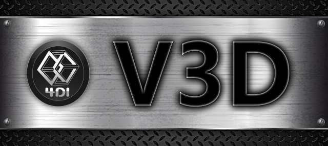

V3D engine
==========
V3D is flexible and cross-platform 3D game engine written in modern C++ with TDD support. It enables a powerful low level C++ API for creating complete 3D applications such as vehicle games.   

  

